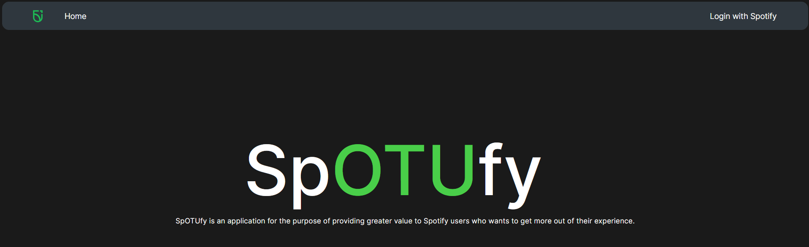

# SpOTUfy 

SpOTUfy is an application for the purpose of providing greater value to the everyday Spotify user who wants to get more out of their experience. 

Public deployment available [here](https://spotufy.chunned.ca).

# Local Deployment
There are two options for deployment:
- Clone this branch (main), place the `.env` file we submitted to Canvas in the repository directory, install the required packages with Pip, then simply `python3 app.py`
- Alternatively, use the `docker-compose.yml` we submitted to Canvas. `docker compose up`

Either way, visit `http://localhost:9191` to access the application.

# Self-Hosting
Self-hosting requires a Spotify account (no subscription required), a Genius.com account. The easiest way to self-host is by using our [docker-compose.yml](https://github.com/Ontario-Tech-NITS/final-project-group-1/blob/main/docker-compose.yml) and [nginx.conf](https://github.com/Ontario-Tech-NITS/final-project-group-1/blob/main/nginx.conf) files.

Put both files in the same directory and set the following values:
- nginx.conf: `server_name` on line 9
- docker-compose.yml: `environment` section starting on line 9
  - `CLIENT_ID` and `CLIENT_SECRET` are obtained from the Spotify Developer console (steps shown below)
  - `GENIUS_TOKEN` is obtained from Genius.com (steps below)
  - `SECRET_KEY` can be generated by running `python` or `python3` (depending on your system) like so: `python -c "import os; print(os.urandom(12).hex())"`
  - `CALLBACK_URL` should be set to `https://your.domain/callback`
  
## Obtaining Spotify Client ID & Secret
- Sign into [Spotify for Developers](https://developer.spotify.com/dashboard)
- On the dashboard, click `Create app`
- Choose an app name and fill the decription with anything. 
- Set the redirect URI to the same as `CALLBACK_URL`
- In the "Which API/SDKs are you planning to use?" section, select **Web API**
- Agree with the terms and press Save
- The app will now be created; click settings and you will be shown your client ID and secret.

## Obtaining Genius.com API token
Generating a Genius API access token is a similar process to Spotify but slightly less involved. Visit the [API Client management page](http://genius.com/api-clients), create a new API client, set the name and website to anything, then click **Generate Access Token**.

# Features 
## Backlog
- Get artist new/upcoming releases
- On demand "Daily Mixes"
- Graph visualization of artist relations

## Available
- Search artist information
- Get list of artist's top tracks and optionally create playlist with those songs
- Search song details
- Get recommendations based on a song and optionally create playlist with those songs
- Get recommended songs based on your listening activity
- Get artists related to a given input artist
- Get song lyrics
- Search artist discography

